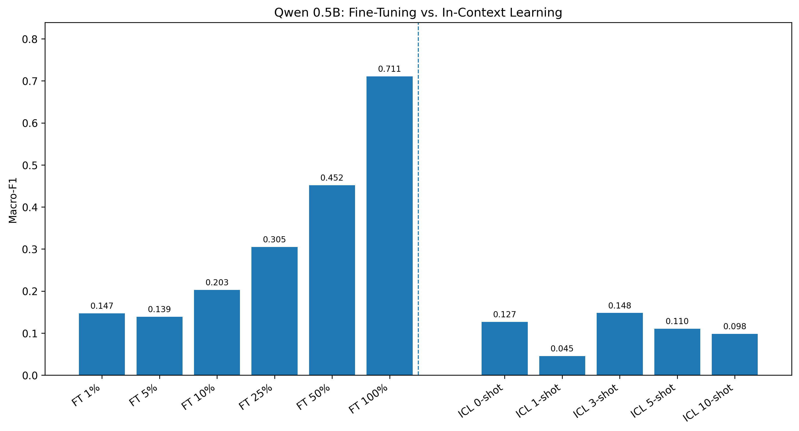
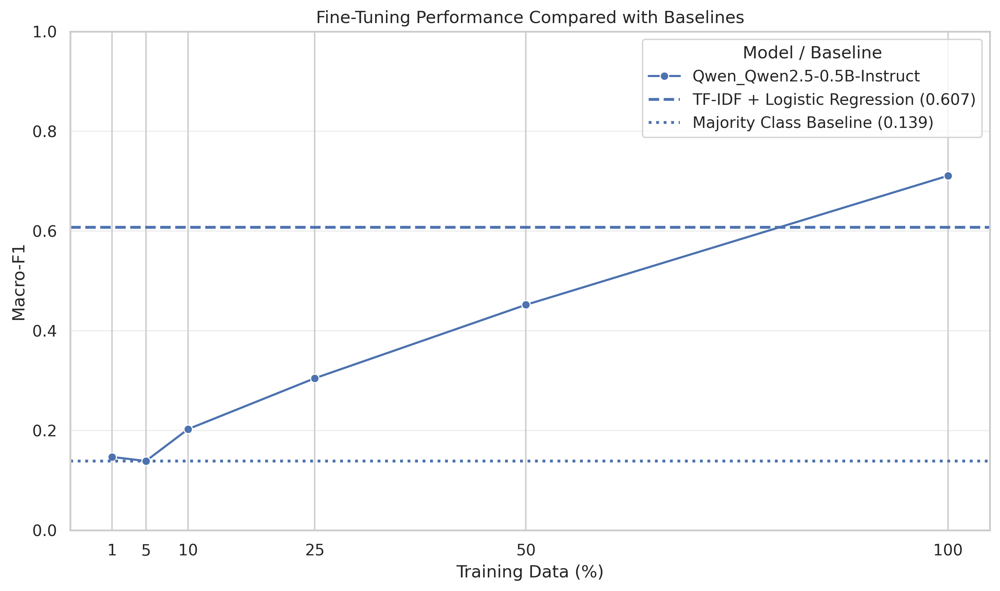
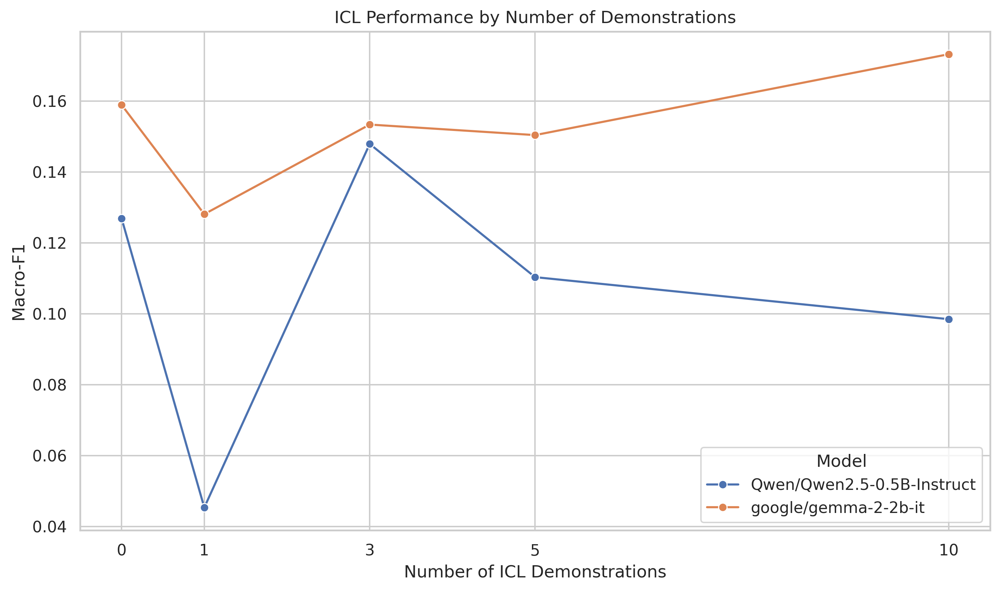
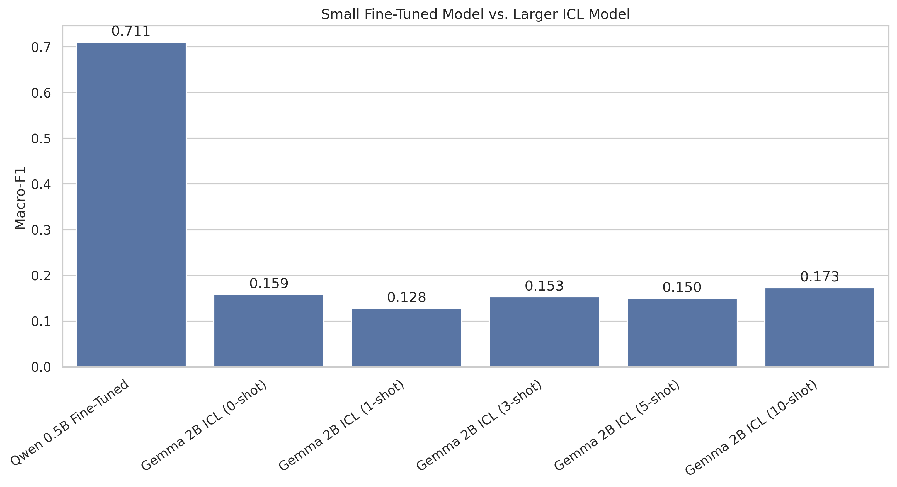

# Fine-Tuning vs. In-Context Learning for Political Bias Classification

Final project for the course **Advanced Models of Language Understanding** (Spring 2026).

**Authors:** Eitan Derdiger, Yedidya Levine, Shira Yogev

## Overview

This project compares two ways of adapting language models to a five-class political bias classification task:

- **LoRA Fine-Tuning** of `Qwen/Qwen2.5-0.5B-Instruct`
- **In-Context Learning (ICL)** with `Qwen/Qwen2.5-0.5B-Instruct` and `google/gemma-2-2b-it`

The target labels are:

`left`, `lean left`, `center`, `lean right`, `right`

The goal was not only to find the strongest configuration, but also to study how Fine-Tuning changes with training-set size, how ICL changes with the number and choice of demonstrations, and whether a larger ICL model can compete with a smaller task-adapted model.

## Main results

| Method | Configuration | Accuracy | Macro-F1 |
|---|---|---:|---:|
| Majority baseline | Most frequent class | 0.530 | 0.139 |
| TF-IDF + Logistic Regression | Full training set | 0.755 | 0.607 |
| Qwen LoRA Fine-Tuning | 10% training data | 0.519 | 0.203 |
| Qwen LoRA Fine-Tuning | 25% training data | 0.616 | 0.305 |
| Qwen LoRA Fine-Tuning | 50% training data | 0.668 | 0.452 |
| **Qwen LoRA Fine-Tuning** | **100% training data** | **0.826** | **0.711** |
| Best Qwen ICL | 3-shot | 0.274 | 0.148 |
| Best Gemma ICL | 10-shot | 0.235 | 0.173 |

The strongest result was obtained by full-data LoRA Fine-Tuning of Qwen 0.5B. The ICL results were much lower and did not improve consistently as more demonstrations were added.

## Key findings

- Fine-Tuning needed enough labeled data before it became effective. With 1% and 5% of the training set, performance stayed close to the majority baseline.
- The classical TF-IDF + Logistic Regression baseline was strong and outperformed all Fine-Tuned models up to the 50% training setting.
- ICL performance was non-monotonic: adding more demonstrations did not consistently improve Macro-F1.
- ICL was sensitive to the specific examples used in the prompt, especially for Qwen.
- Gemma 2B performed better than Qwen 0.5B when both were used with ICL, but it still remained far behind the smaller Qwen model after Fine-Tuning.
- `lean right` was the hardest class for the best Fine-Tuned model.

## Direct Fine-Tuning vs. ICL comparison



This comparison uses the same Qwen 0.5B model on both sides, so the main difference is the adaptation method rather than model size.

## Additional plots

### Fine-Tuning by training-set size



### ICL by number of demonstrations



### Small Fine-Tuned model vs. larger ICL model



## Dataset

The project uses the [Political Bias dataset on Kaggle](https://www.kaggle.com/datasets/mayobanexsantana/political-bias), which is published under the MIT license.

The repository contains:

- `Political_Bias.csv` - original dataset file
- `Political_Bias_Update.csv` - update file
- `political_bias_combined.csv` - both files merged by article link
- `political_bias_cleaned.csv` - final cleaned dataset used by the experiments

After merging and cleaning, the dataset contains **4,600 articles**. It is split into:

- 3,220 training examples
- 690 validation examples
- 690 test examples

Because the test set is imbalanced, **Macro-F1** is used as the main evaluation metric, with accuracy reported as a secondary metric.

## Repository structure

```text
.
├── code/
│   ├── Political_Bias_FT_vs_ICL.ipynb
│   └── requirements.txt
├── data/
│   ├── Political_Bias.csv
│   ├── Political_Bias_Update.csv
│   ├── political_bias_combined.csv
│   └── political_bias_cleaned.csv
├── results/
│   ├── all_metrics.csv
│   ├── experiment_2_results.csv
│   ├── *_predictions_*.csv
│   └── *_inference_times.csv
├── plots/
│   └── generated figures and confusion matrices
├── Final_Project_Report.pdf
├── .gitignore
└── README.md
```

The repository includes the final prediction files, metrics, and plots used in the report. Large downloaded base-model files and LoRA training checkpoints are intentionally excluded from Git and are recreated under `.artifacts/` when the notebook is run.

## Running the notebook

Install the dependencies from the repository root:

```bash
pip install -r code/requirements.txt
```

Then open:

```text
code/Political_Bias_FT_vs_ICL.ipynb
```

The expensive experiment flags are disabled by default. Enable only the stages you want to run:

```python
RUN_FINE_TUNING = False
RUN_ICL = False
RUN_EVALUATION = False
RUN_EXPERIMENT_2 = False
```

A GPU is strongly recommended for the language-model experiments.

## Notes and limitations

- The final ICL evaluation keeps the parser and aggregation logic used during the original experiments for reproducibility.
- The parser searches generated text for label phrases in a fixed order, so outputs containing more than one label can be mapped imperfectly.
- All publishers in the test split also appear in the training split, so the experiment measures classification of new articles from known publishers rather than generalization to unseen publishers.
- Runtime measurements were collected across NVIDIA L4 and T4 sessions, so cross-method runtime comparisons should be interpreted cautiously.

## Report

The complete methodology, results, discussion, and limitations are available in [Final_Project_Report.pdf](Final_Project_Report.pdf).
